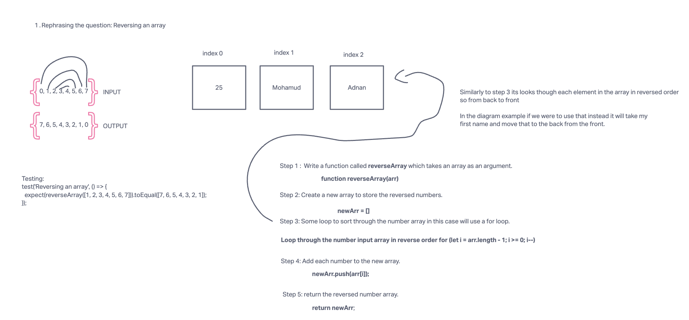

# Challenge Title

Write a function called reverseArray which takes an array as an argument. Without utilizing any of the built-in methods available to your language, return an array with elements in reversed order.

## Whiteboard Process



## Approach & Efficiency

The approach I took for reversing an array was to create a function called `reverseArray` that iterates through the input array and builds a new array with the elements in reverse order.

Here's the basic outline of the approach:

1. Initialize an empty array, `reversedArray`, to store the reversed elements.
2. Iterate through the input array from the last element to the first element.
3. For each element in the input array, push it into the `reversedArray`.
4. Return the `reversedArray`.

The Big O time complexity of this approach is O(n), where 'n' is the number of elements in the input array. This is because we iterate through each element of the array once. The Big O space complexity is also O(n) because we create a new array to store the reversed elements, which can be as large as the input array.

## Solution

``` JavaScript
// Import the reverseArray function (assuming it's defined in a separate file)
const reverseArray = require('./reverseArray');

// Example 1:
const inputArray1 = [1, 2, 3, 4, 5, 6];
const reversed1 = reverseArray(inputArray1);
console.log(reversed1); // Output: [6, 5, 4, 3, 2, 1]```
