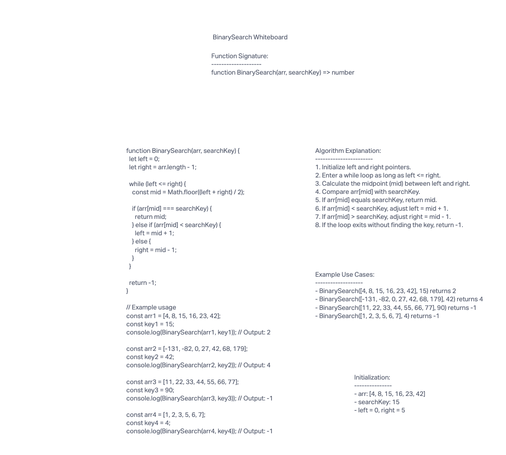

# Binary search in a sorted 1D array

Write a function called BinarySearch which takes in 2 parameters: a sorted array and the search key. Without utilizing any of the built-in methods available to your language, return the index of the array’s element that is equal to the value of the search key, or -1 if the element is not in the array.

## Whiteboard Process



## Approach & Efficiency

- We implemented a binary search algorithm.
- Initialize left and right pointers, which represent the range of elements to search within.
- While the left pointer is less than or equal to the right pointer, calculate the midpoint.
- Compare the element at the midpoint with the search key.
  - If they match, return the index.
  - If the element at the midpoint is less than the search key, adjust the left pointer.
  - If the element at the midpoint is greater than the search key, adjust the right pointer.
- Repeat until the search key is found or the range is exhausted.
- Time Complexity: O(log n) - Binary search efficiently reduces the search space by half in each step.
- Space Complexity: O(1) - We use a constant amount of extra space.

## Solution

```javascript
function BinarySearch(arr, searchKey) {
  let left = 0;
  let right = arr.length - 1;

  while (left <= right) {
    const mid = Math.floor((left + right) / 2);

    if (arr[mid] === searchKey) {
      return mid;
    } else if (arr[mid] < searchKey) {
      left = mid + 1;
    } else {
      right = mid - 1;
    }
  }

  return -1;
}

// Example usage
const arr1 = [4, 8, 15, 16, 23, 42];
const key1 = 15;
console.log(BinarySearch(arr1, key1)); // Output: 2

const arr2 = [-131, -82, 0, 27, 42, 68, 179];
const key2 = 42;
console.log(BinarySearch(arr2, key2)); // Output: 4

const arr3 = [11, 22, 33, 44, 55, 66, 77];
const key3 = 90;
console.log(BinarySearch(arr3, key3)); // Output: -1

const arr4 = [1, 2, 3, 5, 6, 7];
const key4 = 4;
console.log(BinarySearch(arr4, key4)); // Output: -1
```
