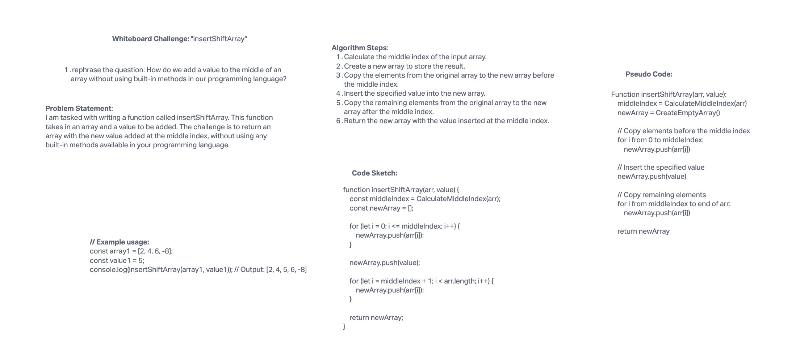

# Challenge Title

Insert and Shift Array in Middle

## Description

I'm tasked with creating a function called insertShiftArray. It takes in an array and a value that needs to be added. The catch is, I can't use any of the built-in methods available in my programming language. My goal is to return an array with the new value added right in the middle.

## Whiteboard Process



## Approach & Efficiency

For the "insertShiftArray" challenge, we followed a step-by-step approach as outlined below:

1. Calculate the middle index of the input array.
2. Create a new array to store the result.
3. Copy the elements from the original array to the new array before the middle index.
4. Insert the specified value into the new array.
5. Copy the remaining elements from the original array to the new array after the middle index.
6. Return the new array with the value inserted at the middle index.

Big O Analysis:

* Time Complexity: O(n), where n is the length of the input array. We iterate through the entire input array twice, once to copy elements before the middle index and once to copy elements after the middle index.
* Space Complexity: O(n), where n is the length of the input array. We create a new array that can potentially be of the same size as the input array.

## Solution

``` JavaScript
function insertShiftArray(arr, value) {
    const middleIndex = CalculateMiddleIndex(arr);
    const newArray = [];

    for (let i = 0; i <= middleIndex; i++) {
        newArray.push(arr[i]);
    }

    newArray.push(value);

    for (let i = middleIndex + 1; i < arr.length; i++) {
        newArray.push(arr[i]);
    }

    return newArray;
}
```

## Examples

``` JavaScript
const inputArray = [2, 4, 6, -8];
const valueToAdd = 5;
const resultArray = insertShiftArray(inputArray, valueToAdd);
console.log(resultArray); // Output: [2, 4, 5, 6, -8]
```
