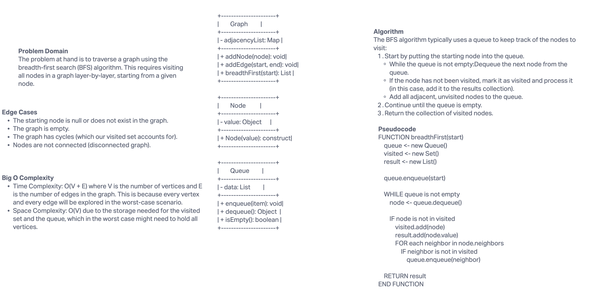

# Graph Breadth-First Traversal

## Problem Domain

The objective is to implement a breadth-first traversal on a graph that takes a starting node as an argument and returns a collection of nodes in the order they were visited.

## Whiteboard Process



Replace `path-to-your-whiteboard-image.png` with the actual path to your whiteboard image file.

## Approach & Efficiency

### Approach

The algorithm uses a queue to traverse the graph layer by layer. Start from the given node, mark it as visited, and enqueue it. Then continue the process with each dequeued node: mark as visited, enqueue its unvisited neighbors, and repeat until the queue is empty.

### Efficiency

- **Time Complexity:** O(V + E), where `V` is the number of vertices and `E` is the number of edges.
- **Space Complexity:** O(V), as it may store all vertices in the queue.

## Solution

To execute the breadth-first traversal, use the following method in the `Graph` class:

```javascript
let visited = myGraph.breadthFirst(startNode);
console.log(visited);
