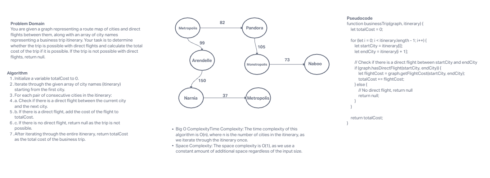

# Business Trip Challenge

## Description

Given a business trip itinerary and a route map of cities with direct flights, determine whether the trip is possible with direct flights and calculate the total cost of the trip if possible.

## Whiteboard Process



## Approach & Efficiency

I used a straightforward approach where I iterated through the given itinerary and checked if there were direct flights between consecutive cities in the graph. If a direct flight existed, I added its cost to the `totalCost`. If there was no direct flight, I returned `null`.

**Time Complexity**: O(n), where n is the number of cities in the itinerary, as we iterate through the itinerary once.

**Space Complexity**: O(1), as we use a constant amount of additional space regardless of the input size.

## Solution

To run the code, you need to have the `Graph` class with the necessary methods (`hasDirectFlight` and `getFlightCost`) and the `businessTrip` function defined as shown in the previous discussions. You can then use the `businessTrip` function with a graph and an itinerary as arguments to calculate the total cost of the business trip.

Example:

```javascript
const graph = new Graph();
graph.setupGraph(); // Set up the graph based on the route map

const itinerary = ['Metropolis', 'Pandora', 'Arendelle', 'Monstropolis', 'Naboo'];

const cost = businessTrip(graph, itinerary);

console.log(`Total cost of the trip: $${cost}`);
