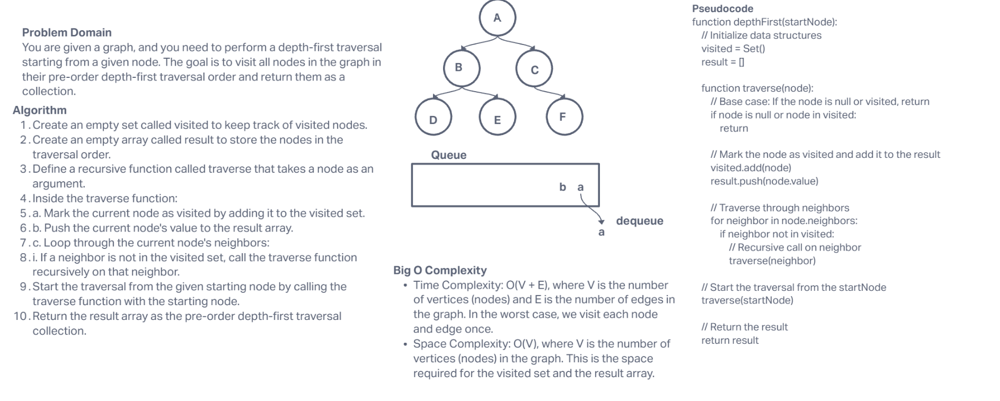

# Depth-First Traversal Challenge

## Description

Conduct a depth-first pre-order traversal on a graph.

## Whiteboard Process



## Approach & Efficiency

For this challenge, I used a depth-first traversal approach, starting from the given node and recursively exploring its neighbors in pre-order. The algorithm uses a `visited` set to keep track of visited nodes and a `result` array to store nodes in their pre-order traversal order.

**Algorithm**:

1. Create an empty set called `visited` to track visited nodes.
2. Create an empty array called `result` to store nodes in traversal order.
3. Define a recursive `traverse` function.
4. Inside `traverse`:
   - Mark the current node as visited and add it to the `visited` set.
   - Add the current node's value to the `result` array.
   - Loop through the current node's neighbors:
     - If a neighbor is not in the `visited` set, recursively call `traverse` on that neighbor.
5. Start the traversal from the given starting node by calling `traverse`.
6. Return the `result` array as the pre-order depth-first traversal collection.

**Time Complexity**: O(V + E), where V is the number of vertices (nodes) and E is the number of edges in the graph. In the worst case, we visit each node and edge once.

**Space Complexity**: O(V), where V is the number of vertices (nodes) in the graph. This is the space required for the `visited` set and the `result` array.

## Solution

To use the code for depth-first traversal, you need to have the `Graph` class with the necessary methods and the `depthFirst` function defined as shown in the code. Here's an example of how to use it:

```javascript
const graph = new Graph();

// Add nodes and edges to the graph

const startNode = graph.getNode('A'); // Replace 'A' with the starting node value
const traversalResult = graph.depthFirst(startNode);

console.log('Depth-First Traversal Result:', traversalResult);
