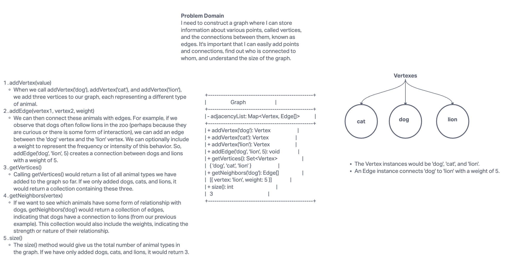

# Graph Implementation Challenge

Implement a graph using an adjacency list, complete with methods for adding vertices and edges, retrieving all vertices and neighbors, and checking the size of the graph.

## Challenge Setup & Execution

Branch Name: `graph`

Challenge Type: New Implementation

### Features

- **addVertex(value)**: Adds a vertex to the graph.
- **addEdge(vertex1, vertex2, weight)**: Adds an edge between two vertices in the graph. A weight is optional.
- **getVertices()**: Returns all of the vertices in the graph as a collection.
- **getNeighbors(vertex)**: Returns a collection of edges connected to the given vertex, including the weight of the connection.
- **size()**: Returns the total number of vertices in the graph.

### Testing

- Vertex can be successfully added to the graph.
- An edge can be successfully added to the graph.
- A collection of all vertices can be properly retrieved from the graph.
- Neighbors are returned with the weight between vertices included.
- The proper size is returned, representing the number of vertices in the graph.
- A graph with only one vertex and edge can be properly returned.

## Whiteboard Process



## Approach & Efficiency

The graph is implemented as a class with an adjacency list to ensure efficient operations, primarily O(1) time complexity for most actions and O(V + E) space complexity.

## Solution

### Running the code

```javascript
const graph = new Graph();

// Add vertices
graph.addVertex('dog');
graph.addVertex('cat');
graph.addVertex('lion');

// Add edges
graph.addEdge('dog', 'lion', 5);

// Retrieve all vertices
const vertices = graph.getVertices(); // Should return {'dog', 'cat', 'lion'}

// Retrieve neighbors
const neighbors = graph.getNeighbors('dog'); // Should return [{ vertex: 'lion', weight: 5 }]

// Check the size of the graph
const size = graph.size(); // Should return 3
