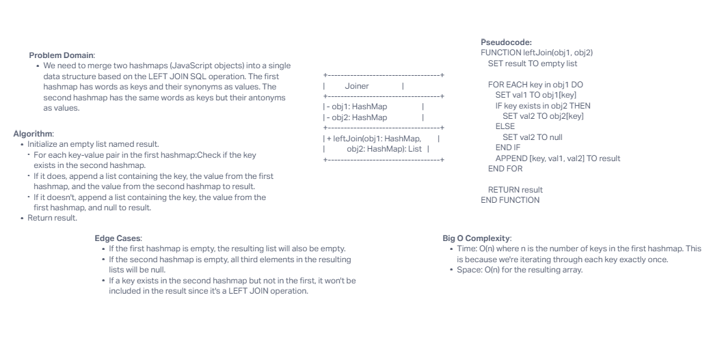

# hashmap-left-join

## Challenge Description

Implement a simplified LEFT JOIN for 2 JavaScript objects (serving as hashmaps). The goal is to LEFT JOIN the two objects based on their keys and provide a combined result.

## Whiteboard Process



## Approach & Efficiency

Approach:

1. Iterate over each key-value pair in the first object (serving as the synonym hashmap).
2. For each key, check if it exists in the second object (serving as the antonym hashmap).
3. If it does, append the antonym value to the result for that key.
4. If it does not, append a `null` value to the result for that key.

Efficiency:

- Time Complexity: O(n) where n is the number of keys in the first hashmap.
- Space Complexity: O(n) for the resulting array.

## Solution

To run the code:

```javascript
function leftJoin(obj1, obj2) {
    let result = [];

    for (let key in obj1) {
        let val1 = obj1[key];
        let val2 = obj2.hasOwnProperty(key) ? obj2[key] : null;
        result.push([key, val1, val2]);
    }

    return result;
}

// Example
const synonyms = {
    diligent: "employed",
    fond: "enamored",
    guide: "usher",
    outfit: "garb",
    wrath: "anger"
};

const antonyms = {
    diligent: "idle",
    fond: "averse",
    guide: "follow",
    flow: "jam",
    wrath: "delight"
};

console.log(leftJoin(synonyms, antonyms));
