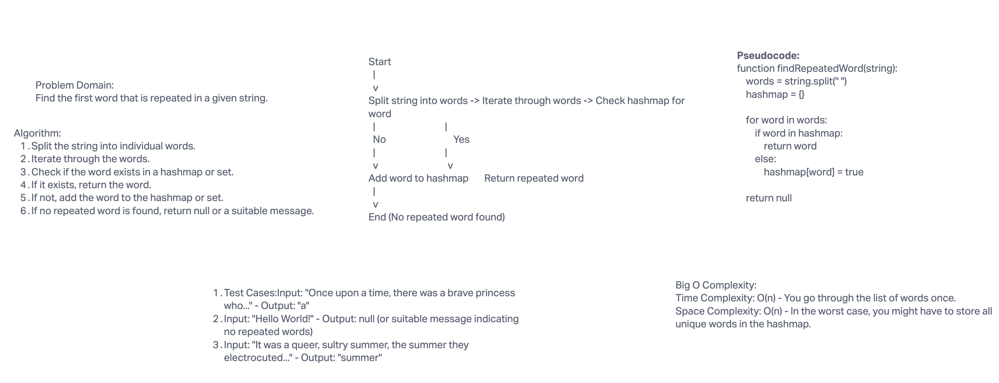

# Repeated Word Challenge

## Challenge README

### Summary

A function called `repeatedWord` that finds the first word to occur more than once in a string.

### Description

Given a string, the function uses a hashmap to efficiently track words that have been encountered. Upon encountering a repeated word, the function returns it.

### Approach & Efficiency

The function iterates through the string, breaking it down into individual words. Each word is then added to a hashmap. If a word is encountered that already exists in the hashmap, that word is returned immediately. This approach has a time complexity of O(n), where n is the number of words in the string.

### Solution

[Link to code](index.js)

*Replace the path placeholder with the actual relative link to your code file.*

### Whiteboard

*Replace the path placeholder with the actual link to your whiteboard image.*

## Feature Tasks

- [x] Implemented the main functionality of finding the first repeated word in a string.
- [ ] More tasks can be added here as needed.
