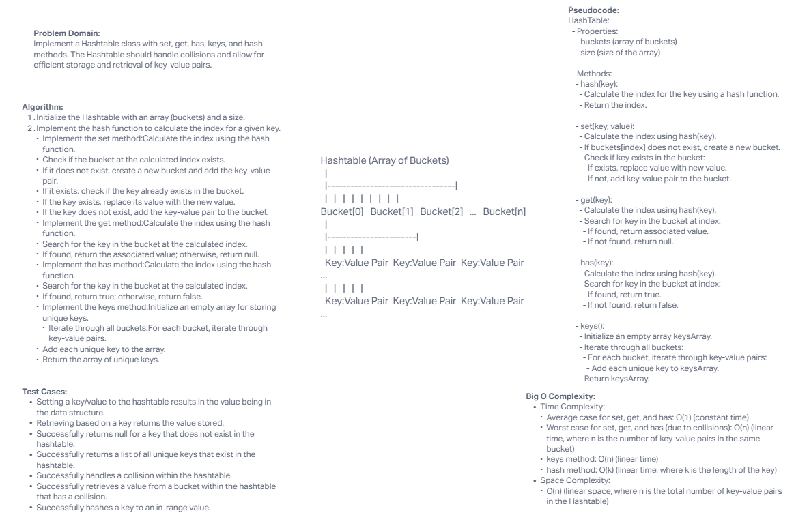

# Hashtable Implementation Challenge

## Description of the Challenge

The challenge is to implement a Hashtable class with specific methods, including set, get, has, keys, and hash. The Hashtable should handle collisions and allow for efficient storage and retrieval of key-value pairs.

## Whiteboard Process



## Approach & Efficiency

- **Approach**: I implemented a Hashtable class that uses an array to store buckets. Each bucket can contain multiple key-value pairs. When setting a key-value pair, I calculate the hash of the key to determine the appropriate bucket. If collisions occur, I store multiple key-value pairs within the same bucket.

- **Efficiency**:
  - The `set` method has a time complexity of O(1) on average for setting a key-value pair, but in the worst case (due to collisions), it can be O(n), where n is the number of key-value pairs in the same bucket.
  - The `get` method has a time complexity of O(1) on average for retrieving a value based on a key, but it can be O(n) in the worst case due to collisions.
  - The `has` method has a time complexity of O(1) on average for checking if a key exists, but it can be O(n) in the worst case due to collisions.
  - The `keys` method has a time complexity of O(n), where n is the total number of key-value pairs in the Hashtable.
  - The `hash` method has a time complexity of O(k), where k is the length of the key.

## Solution

To run the code and see examples of it in action:

1. Clone the repository to your local machine.
2. Navigate to the project directory.
3. Create a new JavaScript file or use a JavaScript environment to interact with the Hashtable implementation.

Example usage of the Hashtable:

```javascript
const Hashtable = require('./index'); // Adjust the path as needed

const table = new Hashtable();

// Setting key-value pairs
table.set('name', 'John');
table.set('city', 'New York');
table.set('country', 'USA');

// Retrieving values
console.log(table.get('name')); // Should print 'John'

// Checking if a key exists
console.log(table.has('city')); // Should print true
console.log(table.has('age')); // Should print false

// Retrieving unique keys
console.log(table.keys()); // Should print ['name', 'city', 'country']

// Handling collisions
table.set('mane', 'Lion');
console.log(table.get('mane')); // Should print 'Lion'

// Hashing a key to an in-range value
console.log(table.hash('name')); // Should be within the table size
