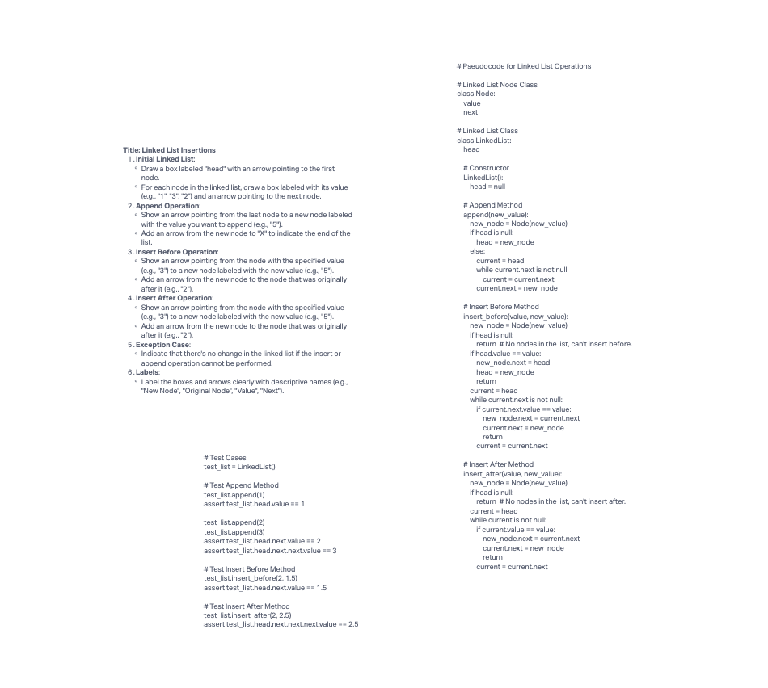

# Challenge Title

Extend a Linked List to allow various insertion methods.

## Whiteboard Process



## Approach & Efficiency

### Append Method

- Approach: We traverse the list to find the last node and append the new node at the end.
- Time Complexity: O(n) where n is the number of nodes in the list (linear time).
- Space Complexity: O(1) (constant space) as we only use a fixed amount of additional space.

### Insert Before Method

- Approach: We traverse the list to find the node with the specified value and insert the new node before it.
- Time Complexity: O(n) where n is the number of nodes in the list (linear time).
- Space Complexity: O(1) (constant space).

### Insert After Method

- Approach: We traverse the list to find the node with the specified value and insert the new node after it.
- Time Complexity: O(n) where n is the number of nodes in the list (linear time).
- Space Complexity: O(1) (constant space).

## Solution

Here's how to run your code and examples of it in action:

```javascript
// Create a new linked list
const list = new LinkedList();

// Append nodes
list.append(1);
list.append(2);
list.append(3);

// Insert before
list.insertBefore(2, 1.5);

// Insert after
list.insertAfter(2, 2.5);

// Print the final linked list
let current = list.head;
while (current) {
  console.log(current.value);
  current = current.next;
}
```
