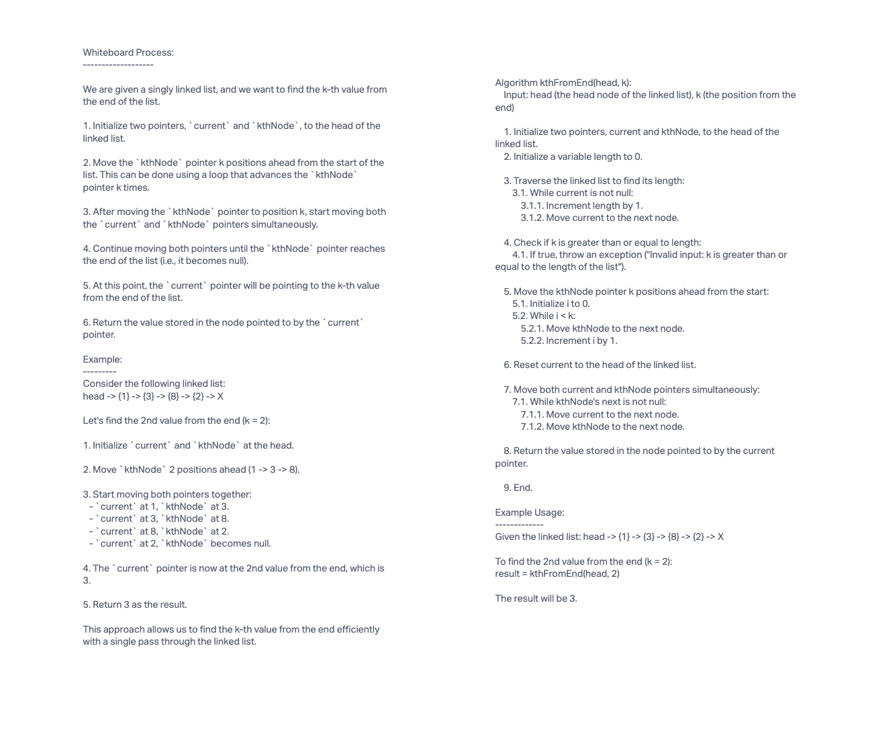

# K-th Value from the End of a Linked List

## Challenge Description

Implement a method `kthFromEnd` for the Linked List class that takes a number `k` as a parameter and returns the value of the node that is `k` places from the tail of the linked list. You have access to the Node class and all the properties and methods created in previous challenges.

## Whiteboard Process



## Approach & Efficiency

For solving the challenge of finding the k-th value from the end of a linked list, I implemented the following approach:

Error Handling: First, I checked if the input value k is valid. If k is negative or not a positive integer, I threw an exception with an appropriate error message.

Find the Length of the Linked List: I traversed the linked list to find its length. This is done by moving through the list while counting each node until the end is reached. This step has a time complexity of O(n), where n is the length of the linked list.

Check for Valid k: I then checked if k is greater than or equal to the length of the linked list. If it is, I threw an exception with an appropriate error message.

Find the K-th Node from the End: To find the k-th node from the end, I utilized two pointers, current and kthNode. I moved the kthNode pointer k positions ahead from the start of the linked list, and then simultaneously moved both current and kthNode until kthNode reached the end of the list. The current pointer will then be at the desired k-th node from the end.

Return the Value: Finally, I returned the value of the k-th node from the end.

The time complexity of this approach is O(n), where n is the length of the linked list, as we need to traverse the list twice: once to find its length and once to find the k-th node from the end. The space complexity is O(1) as we only use a constant amount of additional space for the pointers.

## Solution

```javascript
const ll = new LinkedList();
ll.append(1);
ll.append(3);
ll.append(8);
ll.append(2);

console.log(ll.kthFromEnd(0)); // Output: 2
console.log(ll.kthFromEnd(2)); // Output: 3
```
