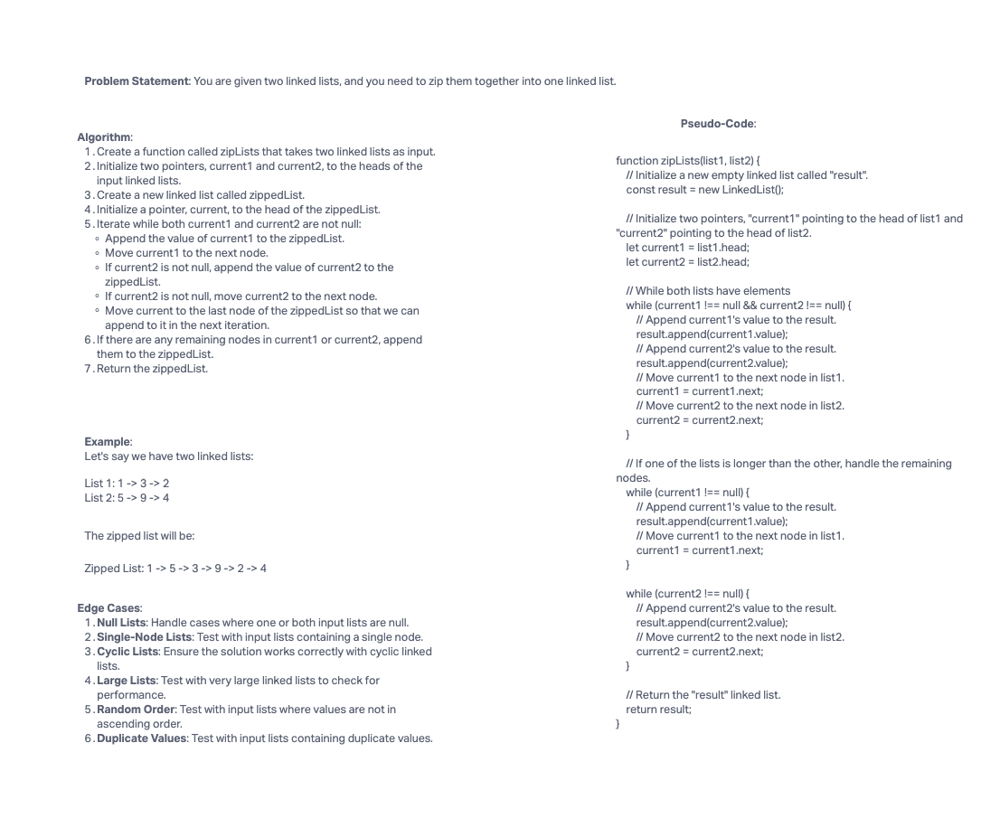

# Challenge Title

Zip Two Linked Lists

## Description

In this coding challenge, you are tasked with implementing a function called `zipLists` that takes two linked lists as input and returns a new linked list by alternating nodes from the two input lists. Additionally, you have the option to implement a stretch goal function that merges two sorted linked lists into a single sorted linked list.

## Whiteboard Process



## Approach & Efficiency

For the `zipLists` function, we traverse both input linked lists simultaneously, using a while loop. At each step, we append the current node from list1 to the result list, followed by the current node from list2. We also handle cases where one list is longer than the other. This approach has a time complexity of O(n), where n is the length of the longer input list, and it uses O(1) additional space.

For the stretch goal function to merge sorted lists, we compare nodes from both lists and build the merged list in sorted order. The time complexity for this operation is also O(n), where n is the total number of nodes in the merged list, and it uses O(1) additional space.

## Solution

To run the code in JavaScript, follow these steps:

1. Create instances of the LinkedList class for list1 and list2.
2. Populate the linked lists with elements.
3. Call the `zipLists(list1, list2)` function to zip the lists and get the result.
4. Print or display the elements of the result linked list.

Example:

```javascript
const { LinkedList, Node } = require('./LinkedList');

// Create instances of linked lists
const list1 = new LinkedList();
const list2 = new LinkedList();

// Populate the linked lists with elements
list1.append(1);
list1.append(3);
list1.append(2);

list2.append(5);
list2.append(9);
list2.append(4);

// Zip the lists
const result = zipLists(list1, list2);

// Print the elements of the result
result.display();
```
