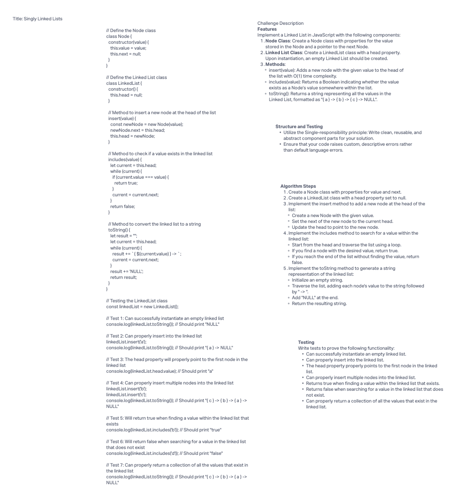

# Challenge Title

Linked List Implementation and Testing in JavaScript

## Description

This challenge involves creating a Linked List in JavaScript and implementing essential features such as insertion, searching, and conversion to a string. The goal is to develop a clean and efficient Linked List data structure and test its functionality.

## Whiteboard Process



## Approach & Efficiency

- **Node Class**: We created a `Node` class to represent individual elements in the Linked List, consisting of `value` and `next` properties.
- **Linked List Class**: The `LinkedList` class was designed with a `head` property and methods for insertion (`insert`), searching (`includes`), and conversion to a string (`toString`).

**Approach**:

- For the `insert` method, we add new nodes to the head of the list, resulting in O(1) time complexity.
- The `includes` method traverses the list linearly with a loop, providing O(n) time complexity in the worst case.
- The `toString` method generates a string by visiting each node once, giving it O(n) time complexity.

**Space Complexity**:

- The space complexity for our solution is O(1) as we only store the head reference and temporary variables for each operation.

## Solution

To run the code, follow these steps:

1. Clone the repository to your local machine.
2. Open your preferred code editor.
3. Navigate to the project directory.
4. Run the JavaScript file containing the Linked List implementation.
5. View the console output for testing results.

Example usage:

```javascript
const linkedList = new LinkedList();

linkedList.insert('a');
linkedList.insert('b');
linkedList.insert('c');

console.log(linkedList.toString()); // Output: "{ c } -> { b } -> { a } -> NULL"
console.log(linkedList.includes('b')); // Output: true
console.log(linkedList.includes('d')); // Output: false
```
