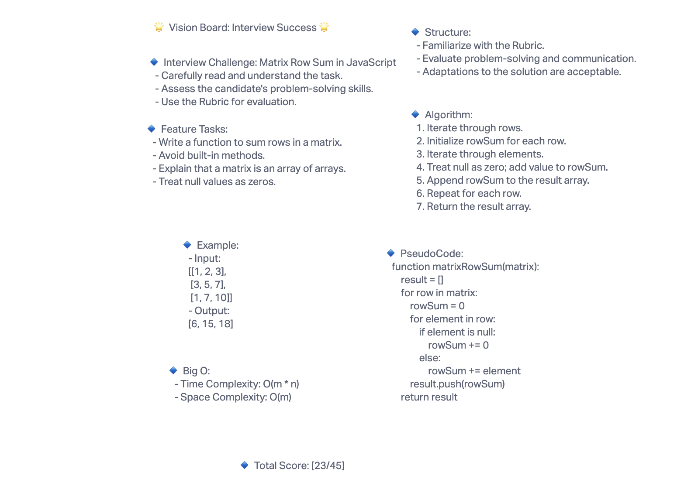

# Challenge Title

Matrix Row Sum Challenge

## Whiteboard Process



## Approach & Efficiency

* **Approach:**

* We start by iterating through each row of the matrix.
* For each row, we initialize a variable (rowSum) to store the sum of the current row.
* We then iterate through the elements in the current row.
* If an element is null, we treat it as zero; otherwise, we add its value to rowSum.
* We append rowSum to the result array.
* This process is repeated for each row in the matrix.
* Finally, we return the result array.

* **Efficiency:**

* **Time Complexity:** The time complexity of this approach is O(m * n), where m is the number of rows and n is the number of columns in the matrix.
* **Space Complexity:** The space complexity is O(m), where m is the number of rows in the matrix.

## Solution

``` JavaScript
function matrixRowSum(matrix) {
    const result = [];
    for (let i = 0; i < matrix.length; i++) {
        let rowSum = 0;
        for (let j = 0; j < matrix[i].length; j++) {
            if (matrix[i][j] === null) {
                rowSum += 0;
            } else {
                rowSum += matrix[i][j];
            }
        }
        result.push(rowSum);
    }
    return result;
}

// Example usage:
const inputMatrix = [
    [1, 2, 3],
    [3, 5, 7],
    [1, 7, 10]
];

const outputArray = matrixRowSum(inputMatrix);
console.log(outputArray); // Output: [6, 15, 18]
```
