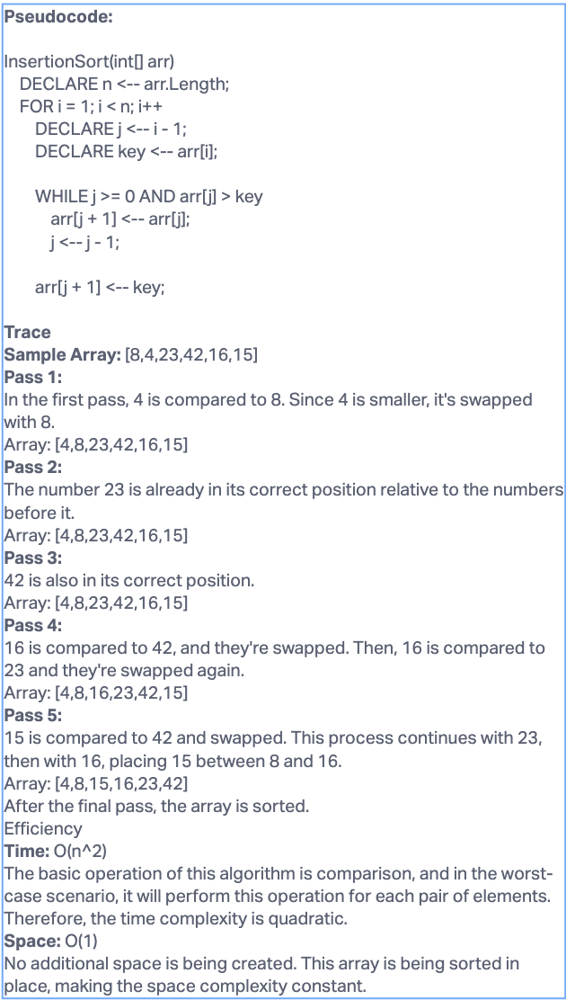

# Insertion Sort

## Challenge

Implementation of the insertion sort algorithm.

## Approach & Efficiency

The algorithm works by repeatedly taking one element from the input array and moving it to its correct position in the already sorted portion of the array. The algorithm maintains two subarrays in a given array:

1. A subarray that is already sorted.
2. The remaining subarray which is unsorted.

The best case time complexity of insertion sort is O(n), the average and worst-case time complexity is O(n^2).

## Solution

[Code Solution](index.js)
