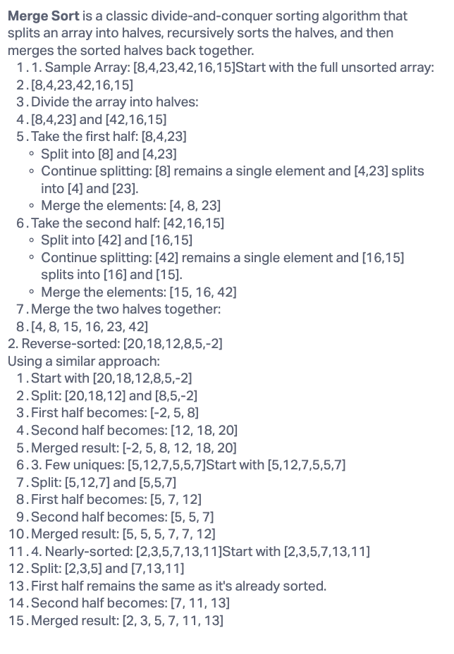

# Merge Sort

Merge Sort is a sorting algorithm that follows the divide-and-conquer paradigm. It divides the unsorted array into n sub-arrays, each containing one element, then repeatedly merges these sub-arrays to produce sorted ones until there's only one sorted array remaining.

## Walk Through

## Big O

- **Time Complexity**: O(n log n) — Due to the recursive nature where the array is continuously divided in half.
- **Space Complexity**: O(n) — Due to the merge step requiring a temporary array.

## Solution

- [Code Implementation](index.js)
