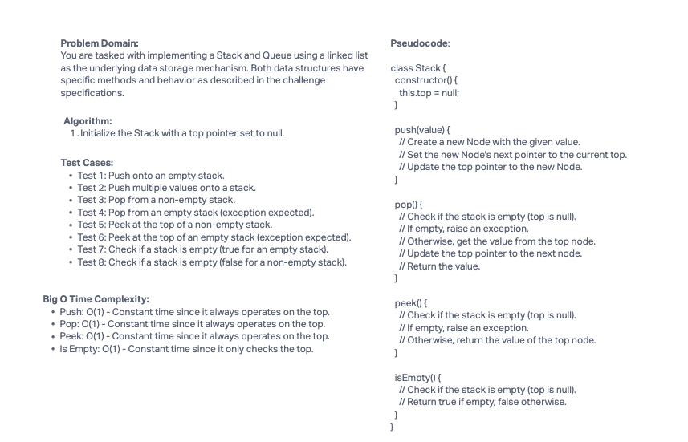

# Challenge Title

Implementing Stack and Queue using Linked List

## Whiteboard Process



## Approach & Efficiency

### Stack:

- We implemented a stack using a linked list where the top of the stack is represented by the head of the linked list.
- Push and pop operations both take O(1) time complexity since they directly manipulate the top of the stack.
- Peek and isEmpty operations also take O(1) time complexity since they only involve checking the top.

### Queue:

- We implemented a queue using a linked list with front and rear pointers.
- Enqueue and dequeue operations both take O(1) time complexity as they directly manipulate the front and rear.
- Peek and isEmpty operations also take O(1) time complexity since they only involve checking the front.

## Solution

To run the code, follow these steps:

1. Clone the repository containing the code.
2. Navigate to the directory where the code is located.
3. Run the test suite to ensure everything is working as expected.

Examples of the code in action:

```javascript
// Create a new stack and push values onto it
const stack = new Stack();
stack.push(1);
stack.push(2);
stack.push(3);

// Pop values from the stack
console.log(stack.pop()); // Output: 3
console.log(stack.pop()); // Output: 2

// Create a new queue and enqueue values into it
const queue = new Queue();
queue.enqueue('A');
queue.enqueue('B');
queue.enqueue('C');

// Dequeue values from the queue
console.log(queue.dequeue()); // Output: 'A'
console.log(queue.dequeue()); // Output: 'B'
```
