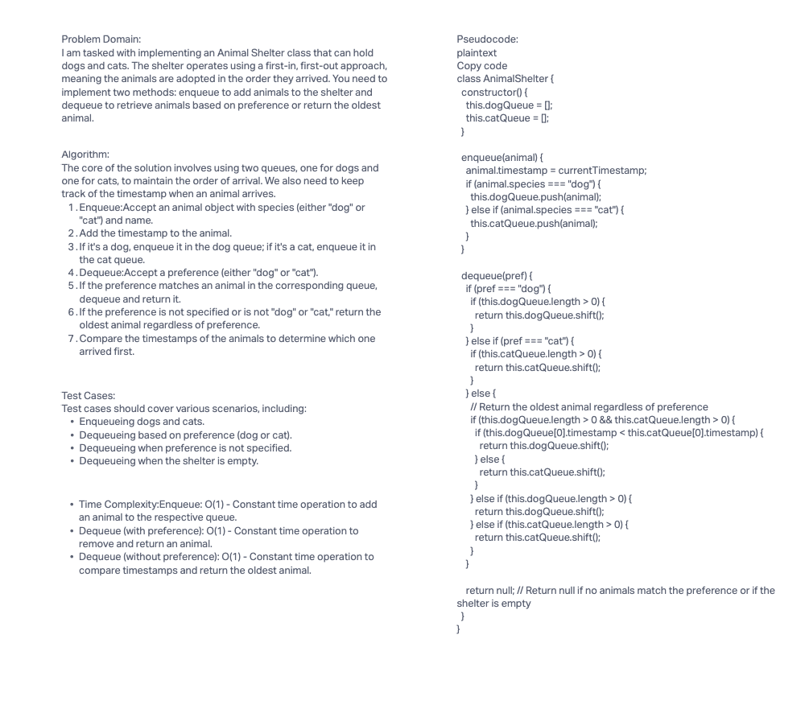

# Challenge Title

First-in, First-out Animal Shelter

## Whiteboard Process



## Approach & Efficiency

Approach
The approach for this challenge is to use two queues, one for dogs and one for cats, to maintain the order of arrival. We also keep track of the timestamp when an animal arrives. When dequeueing, we check the preference and return the corresponding animal from the appropriate queue. If no preference is specified or it's an invalid preference, we return the oldest animal.

## Efficiency

Enqueue:

Time Complexity: O(1) - Constant time to add an animal to the respective queue.
Space Complexity: O(1) - Constant space for storing the animal.
Dequeue (with preference):

Time Complexity: O(1) - Constant time to remove and return an animal.
Space Complexity: O(1) - Constant space for returning the animal.
Dequeue (without preference):

Time Complexity: O(1) - Constant time to compare timestamps and return the oldest animal.
Space Complexity: O(1) - Constant space for returning the animal.
Solution
To run the code, you need to create an instance of the AnimalShelter class and use the enqueue and dequeue methods as shown in the code examples below:

## Solution

```javascript
const shelter = new AnimalShelter();

// Enqueue animals
shelter.enqueue(new Animal("dog", "Buddy"));
shelter.enqueue(new Animal("cat", "Whiskers"));
shelter.enqueue(new Animal("dog", "Rex"));

// Dequeue animals based on preference
console.log(shelter.dequeue("cat")); // Expected: { species: 'cat', name: 'Whiskers', timestamp: ... }
console.log(shelter.dequeue("dog")); // Expected: { species: 'dog', name: 'Buddy', timestamp: ... }

// Dequeue the oldest animal without specifying a preference
console.log(shelter.dequeue()); // Expected: { species: 'cat', name: 'Whiskers', timestamp: ... }
```
