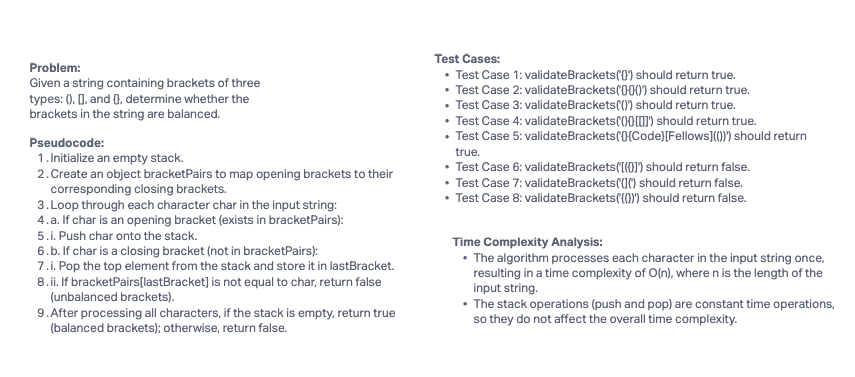

# Challenge Title

Multi-bracket Validation

## Description of the challenge

Write a function called `validateBrackets` that takes a string as input and returns a boolean, representing whether or not the brackets in the string are balanced. The string may contain three types of brackets: round brackets `()`, square brackets `[]`, and curly brackets `{}`.

## Whiteboard Process



## Approach & Efficiency

For this challenge, I used a stack data structure to keep track of opening brackets as I iterate through the input string. Whenever I encounter an opening bracket, I push it onto the stack. When I encounter a closing bracket, I check if it matches the top of the stack (the last opening bracket). If it matches, I pop the opening bracket from the stack; otherwise, I return False. After processing all characters, if the stack is empty, I return True; otherwise, I return False.

The time complexity of this approach is O(n), where n is the length of the input string, as we iterate through the string once. The space complexity is also O(n) in the worst case when the input string consists of all opening brackets.

## Solution

Here is the JavaScript code for the `validateBrackets` function:

```javascript
function validateBrackets(str) {
  const stack = [];
  const bracketPairs = {
    ')': '(',
    ']': '[',
    '}': '{',
  };

  for (const char of str) {
    if (char === '(' || char === '[' || char === '{') {
      stack.push(char);
    } else if (char === ')' || char === ']' || char === '}') {
      const lastBracket = stack.pop();
      if (bracketPairs[char] !== lastBracket) {
        return false;
      }
    }
  }

  return stack.length === 0;
}
```
