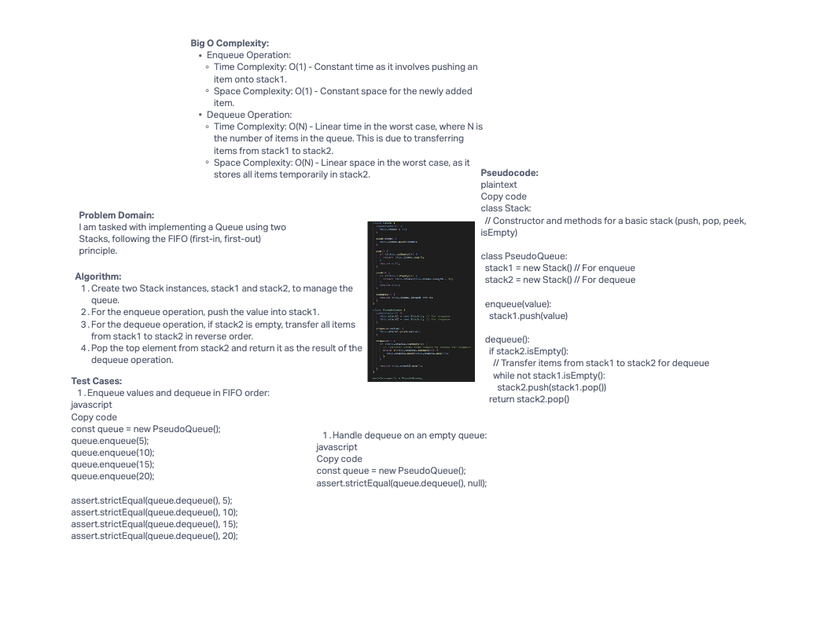

# Challenge Title

Implementing a Queue using two Stacks

## Description

In this challenge, we are tasked with implementing a Queue data structure using two Stack instances. The goal is to achieve first-in, first-out (FIFO) behavior for enqueue and dequeue operations.

## Whiteboard Process



## Approach & Efficiency

### Approach

We created a PseudoQueue class that uses two Stack instances, stack1 and stack2, to mimic the behavior of a Queue. When an item is enqueued, it is pushed onto stack1. For dequeuing, we transfer items from stack1 to stack2 in reverse order if stack2 is empty. Then, we pop from stack2 to simulate dequeuing. This approach ensures that the first item enqueued is the first to be dequeued.

### Big O Complexity

* Enqueue Operation:
  * Time Complexity: O(1)
  * Space Complexity: O(1)
* Dequeue Operation:
  * Time Complexity: O(N) (where N is the number of items in the queue, due to the transfer)
  * Space Complexity: O(N) (temporary storage of items in stack2)

## Solution

``` javascript
const queue = new PseudoQueue();
queue.enqueue(5);
queue.enqueue(10);
queue.enqueue(15);
queue.enqueue(20);

console.log(queue.dequeue()); // Output: 5
console.log(queue.dequeue()); // Output: 10
console.log(queue.dequeue()); // Output: 15
console.log(queue.dequeue()); // Output: 20
```
