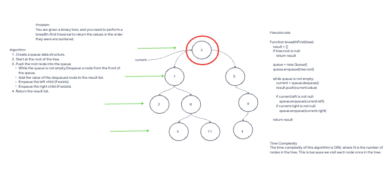

# Breadth-First Traversal

## Description

You are given a binary tree, and you need to perform a breadth-first traversal to return the values in the order they were encountered.

## Whiteboard Process



## Approach & Efficiency

To solve this problem, we will use a breadth-first traversal approach:

### Approach

1. Create a queue data structure.
2. Start at the root of the tree.
3. Push the root node into the queue.
4. Create an empty result array.
5. While the queue is not empty:
   - Dequeue a node from the front of the queue.
   - Add the value of the dequeued node to the result array.
   - Enqueue the left child (if exists).
   - Enqueue the right child (if exists).
6. Return the result array.

### Efficiency

- Big O Time Complexity: O(N) - We visit each node once.
- Big O Space Complexity: O(W) - W is the maximum width of the tree (the number of nodes at the maximum level).

## Solution

```javascript
class Node {
  constructor(value) {
    this.value = value;
    this.left = null;
    this.right = null;
  }
}

class BinaryTree {
  constructor() {
    this.root = null;
  }

  breadthFirst() {
    if (!this.root) return [];

    const result = [];
    const queue = [this.root];

    while (queue.length) {
      const current = queue.shift();
      result.push(current.value);

      if (current.left) {
        queue.push(current.left);
      }
      if (current.right) {
        queue.push(current.right);
      }
    }

    return result;
  }
}
