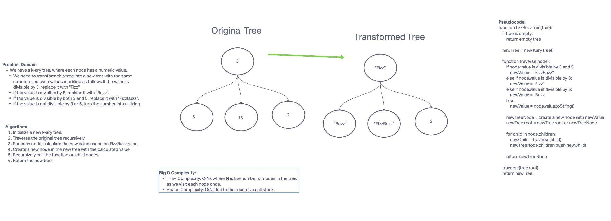

# Challenge Title

The "FizzBuzz Tree" challenge involves transforming a k-ary tree according to FizzBuzz rules.

## Whiteboard Process



## Approach & Efficiency

I took the following approach:

- I defined a `fizzBuzzTree` function that traverses the tree recursively.
- For each node, I determined the new value based on FizzBuzz rules.
- Created a new node in the new tree with the calculated value.
- Recursively called the function on child nodes.
- Returned the new tree.

**Big O Complexity:**

- Time Complexity: O(N), where N is the number of nodes in the tree.
- Space Complexity: O(N) due to the recursive call stack.

## Solution

To run the code and see examples in action, follow these steps:

1. Import the required classes and functions.
2. Create an instance of the original k-ary tree and populate it with nodes.
3. Call the `fizzBuzzTree` function to transform the tree.
4. Use appropriate methods to visualize or traverse the new transformed tree.

Here's an example of how to use the `fizzBuzzTree` function:

```javascript
const { KaryTree, Node, fizzBuzzTree } = require('./tree-fizz-buzz');

// Create and populate the original k-ary tree.
const originalTree = new KaryTree();
// Add nodes to the original tree.

// Transform the tree.
const transformedTree = fizzBuzzTree(originalTree);

// Visualize or traverse the transformed tree using appropriate methods.
