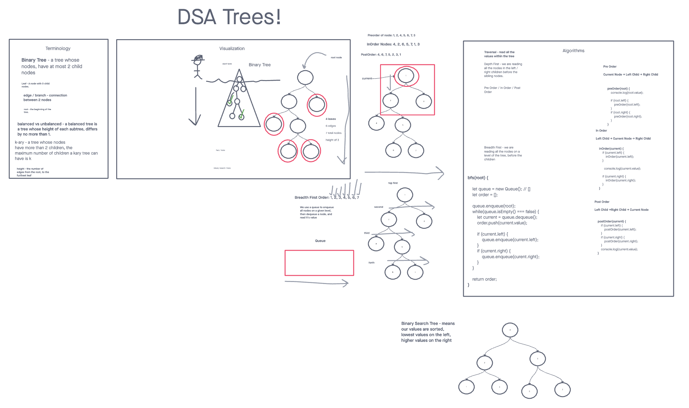
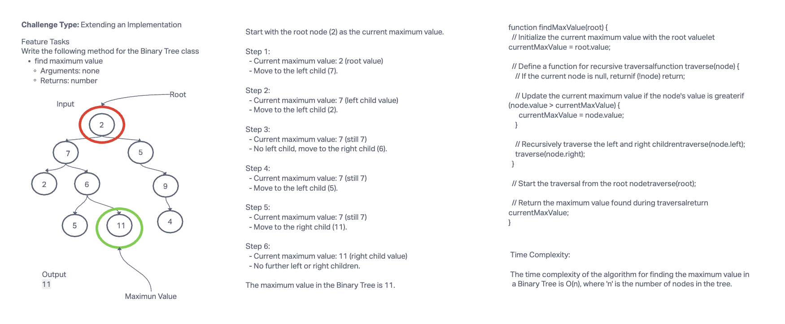

# Trees Implementation Challenge

## Challenge Description

This challenge involves implementing various tree data structures and traversal methods. You are required to create a Node class, a Binary Tree class, and a Binary Search Tree class. Additionally, you need to implement methods for depth-first traversals (pre-order, in-order, and post-order). The goal is to demonstrate your understanding of trees and their operations.

## Whiteboard Process




## Approach & Efficiency

- Node Class: Create a class to represent tree nodes with `value`, `left`, and `right` properties.
- Binary Tree Class: Implement a Binary Tree class with methods for depth-first traversals using recursion.
- Binary Search Tree Class: Create a Binary Search Tree class as a subclass of the Binary Tree class, adding methods for adding and searching values in the tree.

### Big O Notation

- Time Complexity for Traversals: O(n)
- Space Complexity for Traversals: O(h), where h is the height of the tree.

## Features

- Node Class: Represents tree nodes with properties.
- Binary Tree Class: Implements depth-first traversal methods.
- Binary Search Tree Class: Subclass of Binary Tree with additional methods for adding and searching values.

## Testing

- Test 1: Can successfully instantiate an empty tree.
- Test 2: Can successfully instantiate a tree with a single root node.
- Test 3: For a Binary Search Tree, can successfully add a left child and right child properly to a node.
- Test 4: Can successfully return a collection from a pre-order traversal.
- Test 5: Can successfully return a collection from an in-order traversal.
- Test 6: Can successfully return a collection from a post-order traversal.
- Test 7: Returns true/false for the contains method, given an existing or non-existing node value.
- Test 8: Creates a binary search tree, adds values to it, and then uses the findMax method to check if it returns the correct maximum value.

## How to Use

To use the implemented classes and methods, follow these steps:

1. Instantiate a Binary Tree or Binary Search Tree.
2. Add nodes using the `add(value)` method (for Binary Search Tree).
3. Perform depth-first traversals using the `preOrder()`, `inOrder()`, or `postOrder()` methods.
4. Use the `contains(value)` method to check if a value exists in a Binary Search Tree.

## Example

```javascript
// Instantiate a Binary Search Tree
const tree = new BinarySearchTree();

// Add nodes
tree.add(10);
tree.add(5);
tree.add(15);

// Perform a pre-order traversal
const preOrderResult = tree.preOrder();
console.log(preOrderResult); // [10, 5, 15]

// Check if a value exists
const containsResult = tree.contains(5);
console.log(containsResult); // true
